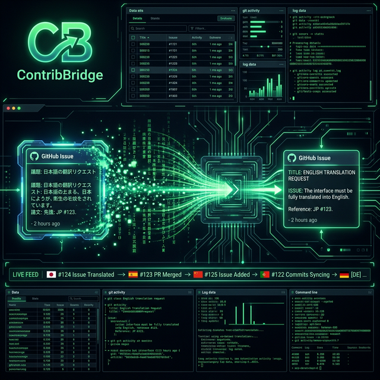
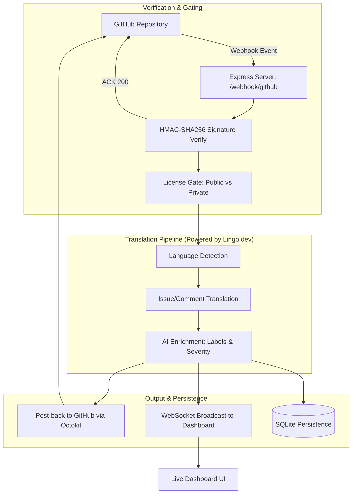

This project is a submission for the Lingo.Dev Hackathon.

# 🌎 ContribBridge



**Translate every GitHub issue in real-time using the Lingo.dev SDK — bidirectionally, across 87 languages, with zero config.**

[**Live Dashboard Demo**](https://ajitpal.github.io/ContribBridge/) | [**GitHub Repo**](https://github.com/ajitpal/ContribBridge)

57% of the world's developers don't write English fluently. They file bugs, find security issues, and request features — but maintainers never see them because they aren't written in English. **ContribBridge** fixes this with three simple command.

---

## 📐 Architecture



## 📂 Project Structure

```text
contribbridge/
├── bin/
│   └── cli.js          # CLI entry point (init, connect, watch)
├── src/
│   ├── server.js       # Express app & GitHub Webhook endpoint
│   ├── pipeline.js     # Main orchestrator for translation flow
│   ├── translate.js    # Lingo.dev SDK wrapper
│   ├── detect.js       # Language detection utility
│   ├── enrich.js       # AI label & severity extraction
│   ├── github.js       # Octokit integration (Post-back & Webhooks)
│   ├── dashboard.js    # WebSocket server for live feed
│   ├── cache.js        # node-cache for deduplication
│   ├── db.js           # SQLite setup (Issues & Licenses)
│   └── middleware/
│       ├── licenseGate.js  # Open-core gating logic
│       └── verifyGhSig.js  # GitHub HMAC verification
├── dashboard/
│   └── index.html      # Real-time dashboard frontend
├── keys/               # RS256 Keypair for offline licensing
└── .env.example        # Environment template
```
## 🚀 Quick Start

Get up and running in less than 60 seconds.

```bash
# 1. Install & Initialize
npx . init  # Prompts for API Keys & sets up .env

# 2. Connect your Repository
npx . connect --repo your-org/your-repo

# 3. Start Watching
npx . watch  # Starts the translation server + dashboard
```

## 🚀 Local Development & Testing

Follow these steps to experience the full ContribBridge pipeline on your own machine.

### 1. Prerequisites
- **Lingo.dev API Key**: 
  - Go to [lingo.dev/dashboard](https://lingo.dev/dashboard).
  - Navigate to **Settings → API Keys** and click **Create new key**.
  - *Tip: The Free tier includes 10,000 words/month.*
- **GitHub PAT (Fine-grained)**: 
  - Go to [github.com/settings/tokens?type=beta](https://github.com/settings/tokens?type=beta).
  - **Permissions**: `Issues` (Read/Write), `Webhooks` (Write), and `Metadata` (Read).
  - **Resource owner**: Select your organization or account.
- **Node.js**: v20 or higher.
- **Tunnel Tool**: [Smee.io](https://smee.io/) or [ngrok](https://ngrok.com/) to receive webhooks locally.

### 2. Set Up the Tunnel (Mandatory for Local)
GitHub needs a public URL to send webhooks to. Start a tunnel to your local port `4000`:
```bash
# Using Smee.io (Recommended)
npx smee-client -u https://smee.io/YOUR_UNIQUE_ID -p 4000 -P /webhook/github
```
*Note the URL (`https://smee.io/...`) for the next step.*

### 3. Initialize ContribBridge
Initialize the environment and connect your repository:
```bash
# 1. Start the wizard
node bin/cli.js init

# 2. Add your Tunnel URL to .env
# Open .env and set: WEBHOOK_URL=https://smee.io/YOUR_UNIQUE_ID

# 3. Connect a public test repository
node bin/cli.js connect --repo your-username/test-repo
```

### 4. Start the Engine
Launch the translation server and the live dashboard:
```bash
node bin/cli.js watch
```
- **Dashboard**: Open `http://localhost:4000` in your browser.
- **Webhook**: Ready for traffic at `localhost:4000/webhook/github`.

### 5. Run a Test
Go to your GitHub test repository and create a **New Issue** in a non-English language:

- **Title**: `¡Hola! El sistema no funciona`
- **Body**: `He intentado registrarme pero el botón de envío no responde en dispositivos móviles.`

**The Magic:** Within seconds, you'll see the translated issue appear on your dashboard, and a translated comment will be posted back to GitHub with suggested labels!

---

## ✨ Features

- **87 Languages Supported**: Powered by the high-fidelity [Lingo.dev SDK](https://lingo.dev).
- **Zero Config**: Automagically detects language and translates to English (or your target locale).
- **Bidirectional**: Maintainers reply in English; ContribBridge translates it back for the contributor.
- **Code Preservation**: Intelligent markdown and code block preservation during translation.
- **Live Dashboard**: Watch translations happen in real-time via a clean WebSocket-powered feed.
- **Open-Core Model**: Free for public repositories; professional features for private repositories.

---

## 🛠️ Tech Stack

| Layer | Technology |
| --- | --- |
| **Translation** | Lingo.dev SDK (detectLocale, localizeText, localizeHtml, localizeChat) |
| **Runtime** | Node.js 20 LTS (ESM) |
| **Framework** | Express.js 4.18 |
| **GitHub API** | @octokit/rest (Octokit) |
| **Real-time** | WebSocket (ws v8) |
| **Database** | SQLite via better-sqlite3 |
| **Authentication** | RS256 JWT (Offline License Verification) |


---

## 📄 License

Community Edition: **Apache 2.0**

---

*Built with ❤️ for the Lingo.dev Hackathon.*
