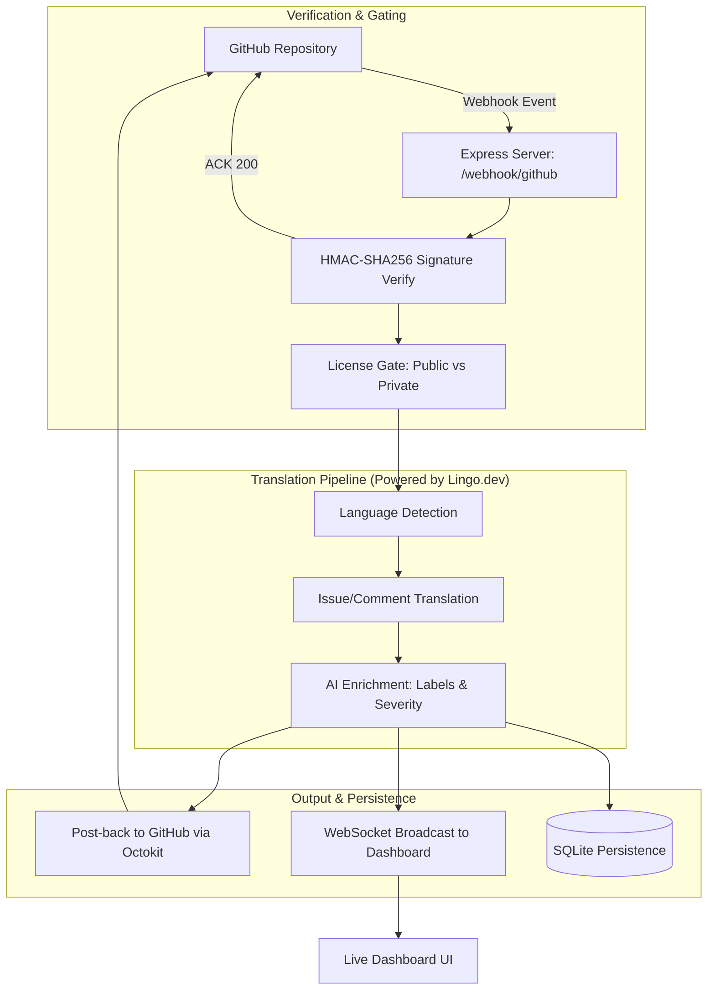

This project is a submission for the Lingo.Dev Hackathon.

# 🌎 ContribBridge

**Translate every GitHub issue in real-time using the Lingo.dev SDK — bidirectionally, across 83 languages, with zero config.**

57% of the world's developers don't write English fluently. They file bugs, find security issues, and request features — but maintainers never see them because they aren't written in English. **ContribBridge** fixes this with three simple command.

---

## 📐 Architecture



## 📂 Project Structure

```text
contribbridge/
├── bin/
│   └── cli.js          # CLI entry point (init, connect, watch)
├── src/
│   ├── server.js       # Express app & GitHub Webhook endpoint
│   ├── pipeline.js     # Main orchestrator for translation flow
│   ├── translate.js    # Lingo.dev SDK wrapper
│   ├── detect.js       # Language detection utility
│   ├── enrich.js       # AI label & severity extraction
│   ├── github.js       # Octokit integration (Post-back & Webhooks)
│   ├── dashboard.js    # WebSocket server for live feed
│   ├── cache.js        # node-cache for deduplication
│   ├── db.js           # SQLite setup (Issues & Licenses)
│   └── middleware/
│       ├── licenseGate.js  # Open-core gating logic
│       └── verifyGhSig.js  # GitHub HMAC verification
├── dashboard/
│   └── index.html      # Real-time dashboard frontend
├── keys/               # RS256 Keypair for offline licensing
└── .env.example        # Environment template
```

---

## 🚀 Quick Start

Get up and running in less than 60 seconds.

```bash
# 1. Install & Initialize
npx . init  # Prompts for API Keys & sets up .env

# 2. Connect your Repository
npx . connect --repo your-org/your-repo

# 3. Start Watching
npx . watch  # Starts the translation server + dashboard
```

---

## ✨ Features

- **83 Languages Supported**: Powered by the high-fidelity [Lingo.dev SDK](https://lingo.dev).
- **Zero Config**: Automagically detects language and translates to English (or your target locale).
- **Bidirectional**: Maintainers reply in English; ContribBridge translates it back for the contributor.
- **Code Preservation**: Intelligent markdown and code block preservation during translation.
- **Live Dashboard**: Watch translations happen in real-time via a clean WebSocket-powered feed.
- **Open-Core Model**: Free for public repositories; professional features for private repositories.

---

## 🛠️ Tech Stack

| Layer | Technology |
| --- | --- |
| **Translation** | Lingo.dev SDK (detectLocale, localizeText, localizeHtml, localizeChat) |
| **Runtime** | Node.js 20 LTS (ESM) |
| **Framework** | Express.js 4.18 |
| **GitHub API** | @octokit/rest (Octokit) |
| **Real-time** | WebSocket (ws v8) |
| **Database** | SQLite via better-sqlite3 |
| **Authentication** | RS256 JWT (Offline License Verification) |


---

## 📄 License

Community Edition: **Apache 2.0**
Pro Edition: **Commercial**

---

*Built with ❤️ for the Lingo.dev Hackathon.*
